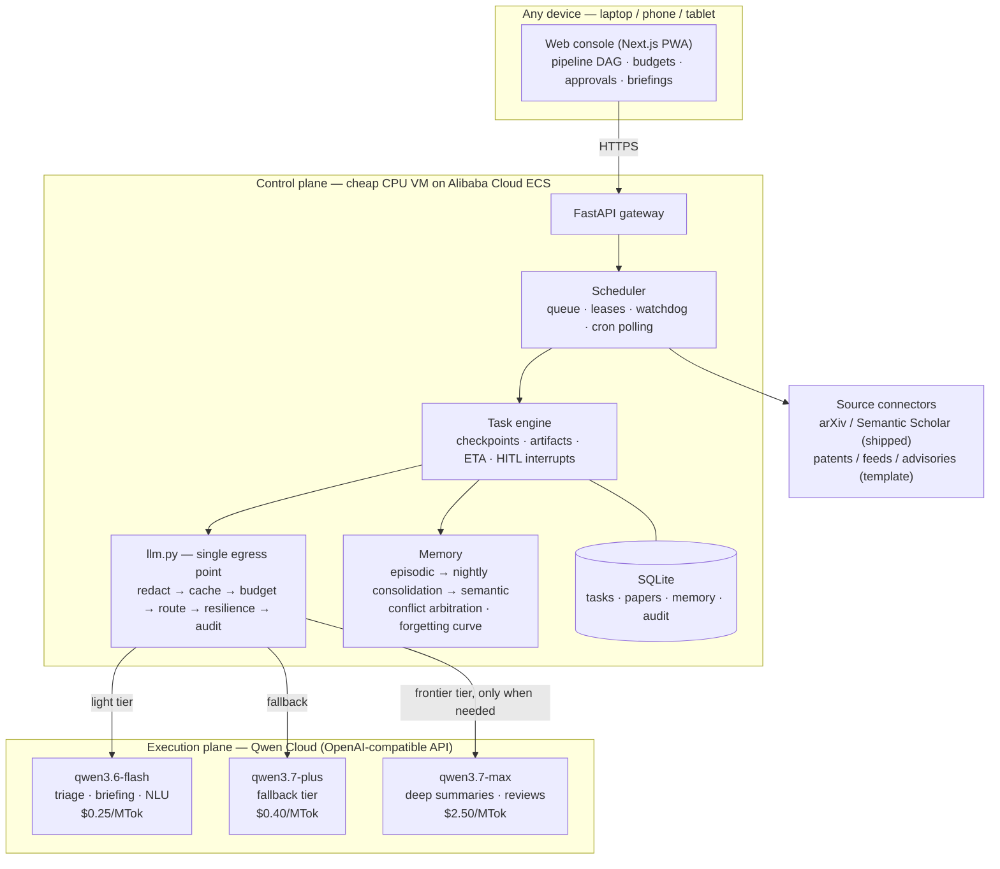

# JarvisQwen — The Autopilot Control Plane for Knowledge Work, on Qwen Cloud

> **Track: Autopilot Agent** · Global AI Hackathon (Qwen Cloud) · [中文文档 →](README.zh.md)

Most of knowledge work follows one loop: **watch sources → triage what matters → process it deeply → deliver a briefing → learn from feedback.** Researchers run it over papers. Analysts run it over competitor moves. Legal teams run it over regulations. Security teams run it over CVE advisories. Everyone runs it by hand, every day, forever.

**JarvisQwen turns that loop into an autonomous, production-grade autopilot** on the Qwen model family — with a cost-aware three-tier router (`$0 rules → qwen3.6-flash → qwen3.7-max`) so every token is spent on the *cheapest model that can do the job*, and with the operational guarantees that let you leave it running unattended: hard budget cutoffs, crash-safe checkpoints, circuit breakers, PII redaction, human-in-the-loop approvals, and a full audit trail.

This build ships the deepest vertical of that pattern: **research literature** — the workflow with the most brutal volume (arXiv alone: 500+ papers/day) and the most expensive naive automation ($10+/day if a frontier model reads everything).

```
Subscribe to a topic once.
Every morning, a briefing of what actually matters is waiting.
It remembers what you cared about, and gets better at deciding for you.
Cost: ~$0.30/day — 30× cheaper than the naive design.
```

## One pattern, many jobs

The pipeline is a template, not a hard-code. Same engine, different connector + prompts:

| Vertical | Watch | Triage | Deep-process | Brief |
|---|---|---|---|---|
| **Research literature** *(shipped)* | arXiv / Semantic Scholar | relevance vs. your research profile | per-paper summary vs. YOUR work | morning digest |
| Patent watch | patent office feeds | relevance to your claims | infringement/novelty analysis | weekly landscape |
| Competitor intel | changelogs, pricing pages, press | material-change detection | impact analysis | Monday briefing |
| Regulatory tracking | gazettes, agency feeds | applicability screening | compliance-gap summary | alert + digest |
| Security advisories | CVE/NVD feeds | "does this hit our stack?" | exploitability + patch plan | on-call alert |

What makes these viable isn't the prompts — it's the **shared infrastructure**: anything that runs 24/7 against a paid, metered API needs budget governance, crash recovery, and auditability. That's the actual product.

## The cost math (real Qwen Cloud pricing)

| Stage | Model | Price (in/out per MTok) | Typical daily cost* |
|---|---|---|---|
| Poll / dedupe / archive / push | — (rule tier, pure code) | $0 | $0 |
| Triage 50 new papers | `qwen3.6-flash` | $0.25 / $1.50 | ~$0.03 |
| Deep-summarize the ~5 that matter | `qwen3.7-max` | $2.50 / $7.50 | ~$0.26 |
| Briefing + memory consolidation | `qwen3.6-flash` | $0.25 / $1.50 | ~$0.01 |
| **Total** | | | **~$0.30/day** |

*One active topic. 4 of 8 pipeline stages are pure code at $0; the frontier model only ever sees what survives triage. A confidence cascade (flash answers first, self-scores, escalates only below threshold) and a 72h semantic cache cut this further.

## Engineering depth — what separates this from demo agents

### 🧠 A real memory subsystem, not a chat log

- **Episodic → semantic lifecycle**: every task execution writes episodic memory; a nightly off-peak job (cheap flash tokens) consolidates recurring facts into long-term semantic memory ("user consistently prioritizes CFR forgetting papers; deprioritizes surveys").
- **Temporal conflict arbitration**: when new facts contradict old ones, the system writes a reconciliation ("X held before 2026-05, updated to Y since") instead of blind overwrites — memories carry timestamps and confidence.
- **Forgetting curve**: memory heat = access frequency × recency decay; cold memories are demoted out of the retrieval index (archived, not destroyed).
- **Two-stage retrieval**: tag/domain filter first, then ranking — retrieval cost doesn't grow linearly with memory size.
- **Closed feedback loop**: your "important / ignore" marks become semantic memory that measurably shifts future triage decisions. The autopilot gets better at *being you*.

### ⚙️ Orchestration built for long-running paid work

- **Per-step checkpoints + artifacts**: every pipeline step snapshots state and emits a verifiable artifact (search list, archive manifest, summary draft). Crash → resume from the last checkpoint; **paid tokens are never spent twice**.
- **Suspend / resume semantics**: tasks waiting on external events release their resources; timers and events wake them.
- **Zombie watchdog + leases**: hung tasks are reclaimed and re-queued automatically; nothing silently occupies the queue.
- **Live pipeline DAG with ETA**: every task renders as a color-coded React Flow graph; ETA is estimated from historical per-step medians and corrected as the run progresses.
- **HITL interrupts**: destructive/outbound steps pause into an approval inbox and resume from checkpoint after sign-off — the pipeline doesn't restart, it *continues*.

### 💰 Cost governance you can bet a credit card on

- **Single egress choke point** ([`llm.py`](server/app/core/router/llm.py)): every LLM call in the system passes `redact → semantic cache → budget guard → tier router → resilient call → audit` — in that order, no exceptions, by construction.
- **Exact metering** at official Qwen prices ([`policy.py`](server/app/core/router/policy.py)) — the budget breaker (alert at 80%, hard trip at 100%) is only as good as its meter.
- **Resilience chain**: exponential backoff with jitter → per-provider circuit breakers → model fallback (`max → plus → flash`). Retry storms are structurally impossible.

### 🔒 Security as a pipeline stage, not an afterthought

- **Three-layer egress redaction** (regex → entropy → NER): PII and credentials become placeholders before leaving the box, restored on return; highest sensitivity blocks egress outright.
- **Prompt-injection isolation**: external content is wrapped as "material, not instructions"; outputs scanned for exfiltration patterns.
- **RBAC + ownership-filtered retrieval**: unauthorized content is filtered *before* it can enter a model context.
- **Append-only audit**: model, tokens, cost, and I/O digests per call — every conclusion traceable to the exact call that produced it.
- **Hardened public exposure**: inbound per-IP rate limiting (pure-ASGI middleware, configurable via `AAOS_RATELIMIT_RPM`, default 240/min) shields the always-on control-plane VM from internet scanning and request floods; the backend API port is bound to `127.0.0.1` only — never published to the public internet — so the sole public attack surface is the web tier that proxies `/api`.

## Architecture

**Control plane / execution plane separation** — a cheap, always-on scheduler (1-core CPU VM on Alibaba Cloud ECS) commands expensive, on-demand Qwen models. Think Kubernetes vs. containers.



### Qwen Cloud integration points

| Concern | Where |
|---|---|
| OpenAI-compatible endpoint (`dashscope-intl.aliyuncs.com/compatible-mode/v1`) | [`providers.py`](server/app/core/router/providers.py) — `QWEN_BASE_URL`, `litellm_route()` |
| Default three-tier routing over the Qwen family | [`settings_store.py`](server/app/core/settings_store.py) |
| Exact per-call cost accounting at official Qwen prices | [`policy.py`](server/app/core/router/policy.py) — `QWEN_PRICING`, `exact_cost()` |
| Zero-click cloud key config (`DASHSCOPE_API_KEY` auto-import on boot) | [`providers.py`](server/app/core/router/providers.py) — `import_env_keys()` |
| Key validation live-probe against `qwen3.6-flash` | [`providers.py`](server/app/core/router/providers.py) — `probe()` |
| Confidence cascade (flash first, escalate to max) | [`cascade.py`](server/app/core/router/cascade.py) |

## Quickstart

### 1. Local (60 seconds, zero keys needed)

```bash
# backend
cd server
python -m venv .venv && .venv/bin/pip install -e ".[dev]" litellm
.venv/bin/uvicorn app.main:app --reload        # http://localhost:8000

# frontend (second terminal)
cd web
npm install && npm run dev                     # http://localhost:3000
```

With no API key configured the system runs in **dry-run mode**: the full pipeline executes with simulated LLM responses at zero cost. To go live, either paste a [Qwen Cloud API key](https://docs.qwencloud.com/developer-guides/administration/api-keys) in **Settings** (auto-normalized, provider-detected, live-probed, Fernet-encrypted) or just put `DASHSCOPE_API_KEY=sk-...` in a `.env` at the repo root — it's imported automatically on boot.

### 2. Alibaba Cloud ECS (production)

```bash
curl -fsSL https://raw.githubusercontent.com/Vector897/JarvisQwen/main/install.sh | bash
```

Open `http://<ECS-IP>:3000` and click **Quick Try** to enter the console (no login — single-user local mode), add your key, add a subscription. Done — your first briefing arrives tomorrow morning. Only expose TCP **22 and 3000** in the security group: the backend (8000) is loopback-only and inbound per-IP rate limiting is on by default. All state lives in `./data`; migrating hosts is copy-and-compose-up.

## Console

Responsive Next.js PWA (add-to-home-screen on mobile), **English by default, 中文 toggle**: live pipeline DAG per task, cost dashboard with budget progress, subscription manager, searchable knowledge library with cross-paper QA, approval inbox, audit trail, dark mode.

## Tests

```bash
cd server
.venv/bin/python -m pytest          # routing / redaction / breaker / checkpoint / budget
.venv/bin/python tests/smoke_e2e.py # boot → login → task → pipeline → audit
```

## License

[MIT](LICENSE)
