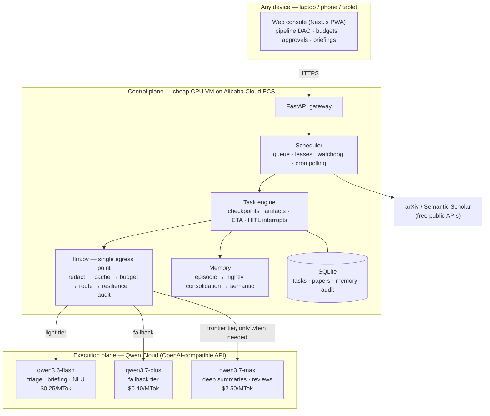

# JarvisQwen — Your 24/7 Research Autopilot on Qwen Cloud

> **Track: Autopilot Agent** · Global AI Hackathon (Qwen Cloud) · [中文文档 →](README.zh.md)

**JarvisQwen is an autonomous agent that monitors, triages, deep-reads, archives, and briefs the world's research for you — end to end, around the clock — while you sleep.** It orchestrates the entire Qwen model family (`qwen3.6-flash` → `qwen3.7-plus` → `qwen3.7-max`) through a cost-aware three-tier router, so every token is spent on the *cheapest model that can do the job*.

Most hackathon agents are demos you babysit. JarvisQwen is built to pass a harder test: **can you leave it alone for a month?** Hard budget cutoffs, crash-safe checkpoints, circuit breakers, PII redaction, human-in-the-loop approvals, and a full audit trail say yes.

```
You subscribe to a topic once.
Every morning, a briefing of what actually matters is waiting for you.
Total cost: about the price of a coffee — per month, not per day.
```

---

## The problem

arXiv alone publishes **500+ papers a day**. Every researcher, analyst, and R&D team runs the same manual loop: search → skim → judge relevance → download → read → summarize → repeat tomorrow. It consumes 1–2 hours daily, and the moment you stop, you fall behind.

Naively automating this with a frontier LLM is worse: feeding 200 papers/day through a top-tier model costs **$10+/day**, and a single crashed run can silently re-bill everything.

## What JarvisQwen does

One subscription triggers a fully autonomous, self-correcting pipeline:

```
📡 Poll arXiv/Semantic Scholar   (pure code, $0)
 → 🧹 Dedupe by title+ID fingerprint   (pure code, $0)
 → 🎯 Relevance triage against your research profile   (qwen3.6-flash)
 → 📥 Download PDF + archive with metadata   (pure code, $0)
 → 📝 Deep per-paper summary: contributions, methods, relation to YOUR work   (qwen3.7-max)
 → 🧠 Write episodic memory → nightly consolidation into semantic memory   (qwen3.6-flash, off-peak)
 → 📰 Morning briefing pushed to web console / Telegram / email
 → 👍 Your "important / ignore" feedback loops back into future triage
```

4 of the 8 stages cost exactly $0. The expensive model only ever sees the few papers that survive triage.

### The cost math (real Qwen Cloud pricing)

| Stage | Model | Price (in/out per MTok) | Typical daily cost* |
|---|---|---|---|
| Poll / dedupe / archive / push | — (rule tier, pure code) | $0 | $0 |
| Triage 50 new papers | `qwen3.6-flash` | $0.25 / $1.50 | ~$0.03 |
| Deep-summarize the ~5 that matter | `qwen3.7-max` | $2.50 / $7.50 | ~$0.26 |
| Briefing + memory consolidation | `qwen3.6-flash` | $0.25 / $1.50 | ~$0.01 |
| **Total** | | | **~$0.30/day** |

*Tracking one active topic. A naive "frontier-model-reads-everything" design costs ~$10/day for the same coverage — **JarvisQwen is ~30× cheaper** at equal quality where quality matters.

Semantic caching (72h TTL) and confidence-based cascading (flash answers first, self-scores, escalates to max only below threshold) cut this further.

## Why you can actually leave it alone

This is the part that makes it an *autopilot* rather than a demo:

| Guarantee | Mechanism |
|---|---|
| **Never blows your budget** | Daily budget cap: alert at 80%, hard circuit-break at 100% — running tasks suspend instead of burning money. Every call is metered against the official Qwen price table ([`policy.py`](server/app/core/router/policy.py)). |
| **Never pays twice** | Every pipeline step checkpoints its state. Crash, reboot, or network loss → resume from the last checkpoint. Paid intermediate results are never recomputed. |
| **Never melts down retrying** | Exponential backoff with jitter, per-provider circuit breakers, and model fallback chains (`max → plus → flash`). Zombie tasks are reaped by a watchdog and re-queued. |
| **Never leaks your data** | An egress redaction gateway (regex → entropy → NER, three layers) replaces PII/keys with placeholders before anything leaves the box, and restores them on return. High-sensitivity mode blocks egress outright. |
| **Never acts beyond its authority** | Destructive/outbound operations queue for human approval; approved tasks resume seamlessly from checkpoint. Prompt-injection isolation wraps all external content as "data, not instructions". |
| **Never lies about what it did** | Append-only audit log of every call: model, tokens, cost, input/output digests. Any conclusion traces back to the exact call that produced it. |

## Architecture

**Control plane / execution plane separation** — a cheap, always-on scheduler (runs on a 1-core CPU VM) commands expensive, on-demand Qwen models. Think Kubernetes vs. containers.



Every LLM request in the system flows through **one** choke point — [`server/app/core/router/llm.py`](server/app/core/router/llm.py) — where six stages are applied in order: **redaction → semantic cache → budget guard → tier routing → resilient call (backoff / breaker / fallback) → audit accounting**. No prompt can bypass safety or metering by construction.

### Qwen Cloud integration points

| Concern | Where |
|---|---|
| OpenAI-compatible endpoint (`dashscope-intl.aliyuncs.com/compatible-mode/v1`) | [`providers.py`](server/app/core/router/providers.py) — `QWEN_BASE_URL`, `litellm_route()` |
| Default three-tier routing over the Qwen family | [`settings_store.py`](server/app/core/settings_store.py) |
| Exact per-call cost accounting at official Qwen prices | [`policy.py`](server/app/core/router/policy.py) — `QWEN_PRICING`, `exact_cost()` |
| Key validation live-probe against `qwen3.6-flash` | [`providers.py`](server/app/core/router/providers.py) — `probe()` |
| Confidence cascade (flash first, escalate to max) | [`cascade.py`](server/app/core/router/cascade.py) |

## Quickstart

### 1. Local (60 seconds, zero keys needed)

```bash
# backend
cd server
python -m venv .venv && .venv/bin/pip install -e ".[dev]" litellm
.venv/bin/uvicorn app.main:app --reload        # http://localhost:8000

# frontend (second terminal)
cd web
npm install && npm run dev                     # http://localhost:3000
```

With no API key configured the system runs in **dry-run mode**: the full pipeline executes with simulated LLM responses at zero cost. Paste a [Qwen Cloud API key](https://docs.qwencloud.com/developer-guides/administration/api-keys) in **Settings** to go live — it is auto-normalized, provider-detected, live-probed, and stored Fernet-encrypted.

### 2. Alibaba Cloud ECS (production)

```bash
curl -fsSL https://raw.githubusercontent.com/Vector897/JarvisQwen/main/install.sh | bash
```

Open `http://<ECS-IP>:3000`, log in with the generated password in `data/admin_password.txt`, paste your `DASHSCOPE_API_KEY`, add a subscription. Done — your first briefing arrives tomorrow morning. All state lives in `./data`; migrating hosts is copy-and-compose-up.

## Console

Responsive Next.js PWA (add-to-home-screen on mobile): live pipeline DAG per task (React Flow, color-coded steps, ETA), cost dashboard with budget progress, subscription manager, searchable knowledge library with cross-paper QA, approval inbox, audit trail, bilingual UI (EN/中文), dark mode.

## Tests

```bash
cd server
.venv/bin/python -m pytest          # routing / redaction / breaker / checkpoint / budget
.venv/bin/python tests/smoke_e2e.py # boot → login → task → pipeline → audit
```

## Beyond research papers

The pipeline is a template, not a hard-code: *poll → filter cheap → act expensive → brief → learn from feedback* generalizes to patent watch, competitor monitoring, regulatory tracking, and security-advisory triage. The task-template system ships with the research vertical as its flagship.

## License

[MIT](LICENSE)
